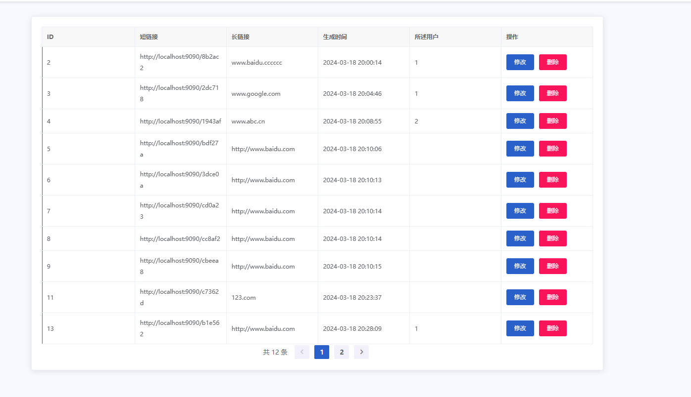
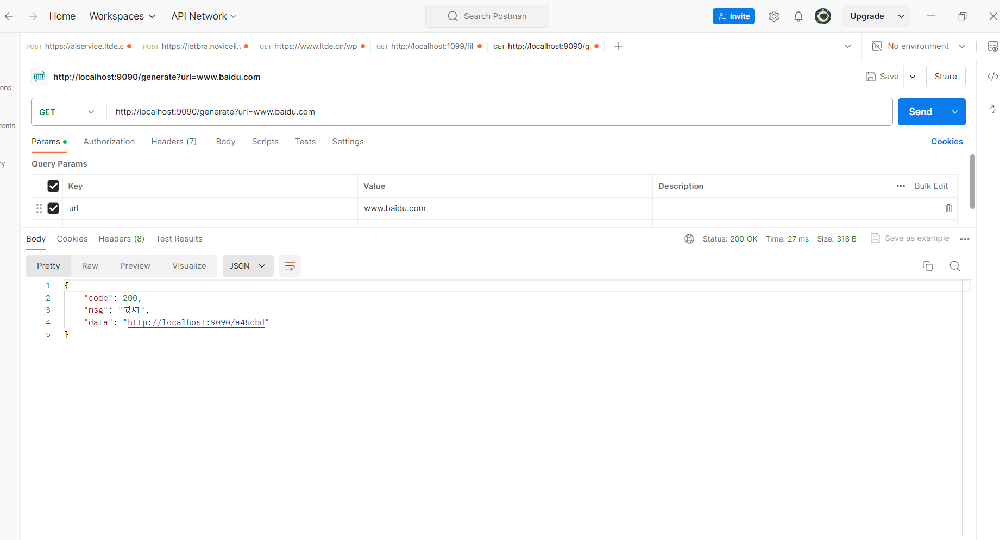

# 短链接生成器

## 项目介绍

本项目是一个基于Vue和SpringBoot的前后端分离的短链接生成器。项目主要功能是将长链接转化为短链接，使得链接更加简洁易用。
前端比较烂，后端还可以，属于**半成品**。不建议直接上线使用，适合初学者研究。

## 技术栈

- 前端：Vue.js
- 后端：SpringBoot

## 特点

1. 后端使用SpringBoot构建，代码结构清晰，逻辑处理稳健，提供了可靠的短链接生成和管理服务。
2. 前端使用Vue.js实现，虽然界面和交互可能不够完美，但功能实现完整，可以满足基本的短链接生成和使用需求。

## 演示

首页生成会自动复制到剪切板

## 如何开始

1. 克隆本项目到本地
2. 安装必要的依赖
3. 运行项目

具体的运行步骤，请参考我们的[快速开始指南](./QUICKSTART.md)。

## 贡献

## 许可

本项目采用[MIT许可协议](./LICENSE)。

## 联系我们

如果你在使用过程中遇到任何问题，或者有任何建议，欢迎通过Issues向我们反馈。